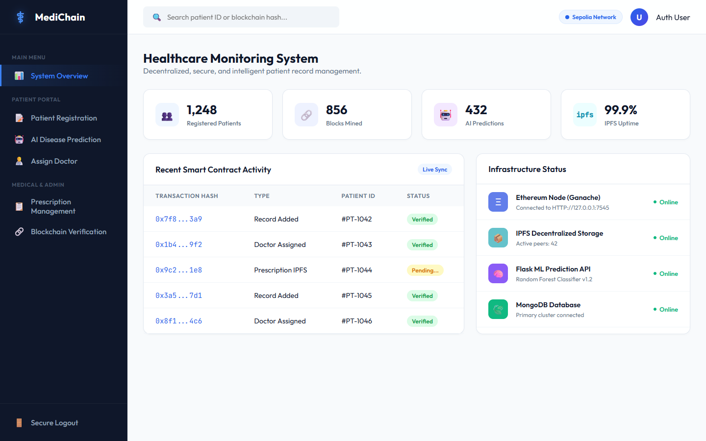
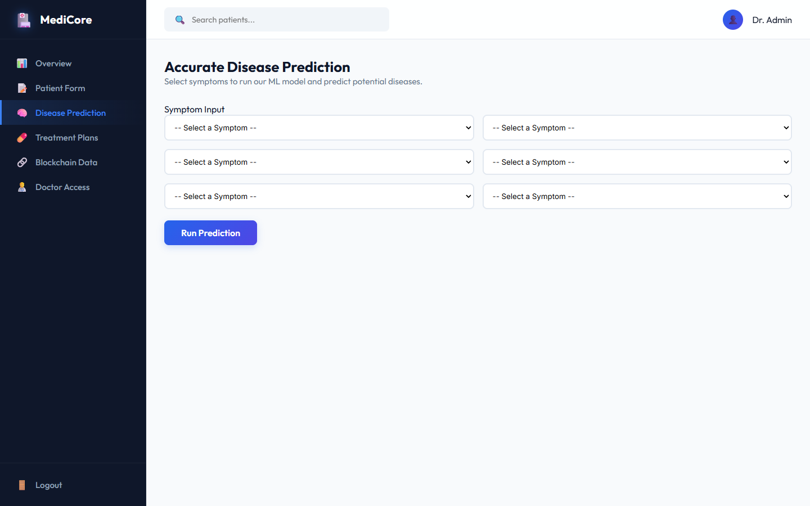
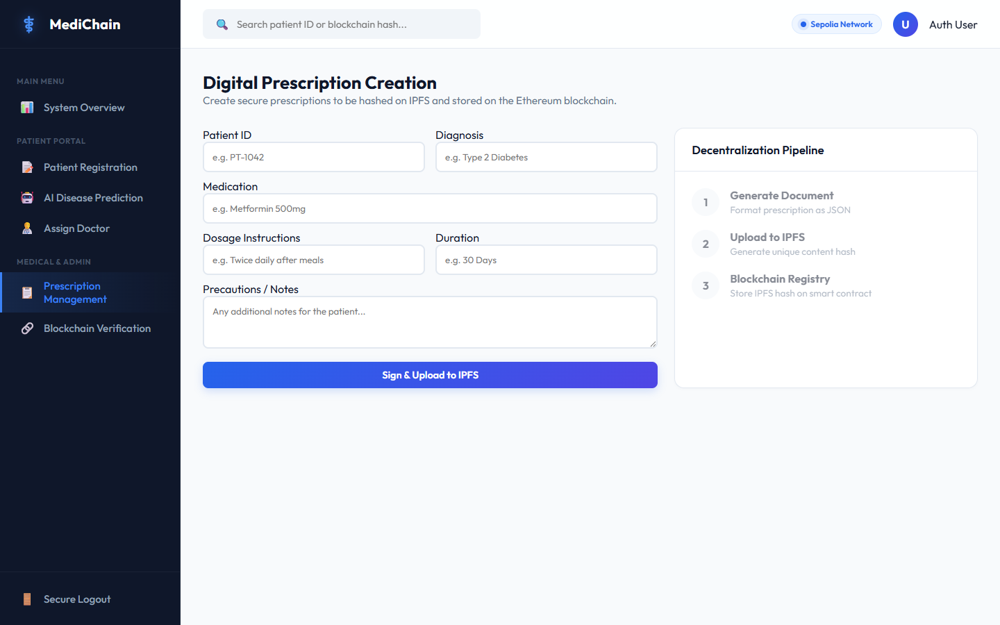
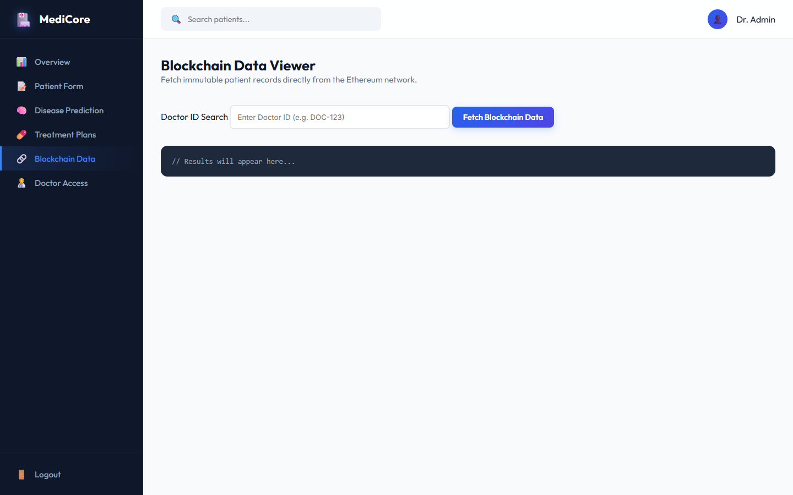

# Decentralized Patient Record Management System 🏥🔗

A secure, transparent, and intelligent healthcare monitoring system leveraging **Blockchain (Ethereum)**, **Machine Learning (Random Forest)**, and **IPFS (InterPlanetary File System)**.

This system provides a full-stack decentralized application (DApp) that ensures patient medical records and digital prescriptions are immutable, cryptographically secure, and accessible via role-based access control.

## 🌟 Key Features

1. **Role-Based Access Control**: Separate secure portals for Patients, Doctors, and Medical Agents using wallet-based authentication.
2. **AI Disease Prediction**: Integrated Flask API running a Random Forest Classifier to predict potential diseases based on patient-reported symptoms.
3. **Digital Prescription Generation**: A structured interface for doctors to securely create, sign, and issue digital prescriptions.
4. **Decentralized Storage (IPFS)**: Sensitive medical documents (like prescriptions) are hashed and stored off-chain on IPFS to preserve privacy and minimize gas costs.
5. **Blockchain Registry**: Smart contracts deployed on the Ethereum network (Sepolia/Ganache) permanently record IPFS content hashes, ensuring 100% tamper-evident medical histories.

## 📸 System Previews

### 📊 Infrastructure Dashboard
The command center for system monitoring, live blockchain synchronization, and network status (Ganache, IPFS, MongoDB, Flask).


### 🤖 AI Disease Prediction (Machine Learning)
Intelligent symptom analysis using a Random Forest model to provide preliminary diagnoses.


### 📋 Prescription Management (IPFS + Blockchain)
A streamlined interface for doctors to issue prescriptions, visually demonstrating the pipeline of JSON generation, IPFS hashing, and Blockchain registry.


### 🔗 Blockchain Verification
Direct query access to the Ethereum smart contracts to fetch immutable patient histories using cryptographic wallet signatures.


## 🛠️ Technology Stack

* **Frontend**: HTML5, CSS3 (Outfit & JetBrains Mono fonts), Handlebars (`.hbs`), jQuery, Web3.js
* **Backend (Node)**: Node.js, Express.js, Mongoose (MongoDB)
* **Backend (AI)**: Python, Flask, Scikit-Learn, Pandas, Numpy
* **Blockchain**: Solidity (v0.8.19), Truffle Suite, Ganache
* **Decentralized Storage**: IPFS (InterPlanetary File System)

## 🚀 Getting Started

### Prerequisites
* Node.js (v16+)
* Python 3.8+
* MongoDB Community Server running on `localhost:27017`
* Ganache running on `HTTP://127.0.0.1:7545`
* MetaMask Browser Extension

### Installation

1. **Install Node Dependencies**:
   ```bash
   npm install
   ```

2. **Install Python Dependencies** (for ML Server):
   ```bash
   pip install flask flask-cors scikit-learn pandas numpy
   ```

3. **Deploy Smart Contracts**:
   ```bash
   cd Blockchain
   truffle migrate --reset
   ```
   *Make sure to copy your new contract address into `src/index.js`.*

4. **Start the AI Prediction Server**:
   ```bash
   cd Model
   python server.py
   ```

5. **Start the Node Server**:
   ```bash
   node src/index.js
   ```

6. Open your browser and navigate to `http://localhost:3000`.

## 🔒 Security Architecture

1. **Confidentiality**: Raw medical data is stored on IPFS or MongoDB; only cryptographic hashes are stored on the public ledger.
2. **Integrity**: Any tampering with a prescription alters its IPFS hash, causing a mismatch with the blockchain registry.
3. **Availability**: Decentralized nodes ensure that patient history is not locked in a single centralized hospital database.

---
*Developed as a Capstone Project by Roop Sai Charan Kothamasu, Ganesh Mogasati, Pujitha kamisetty, and Asish Manoj Reddy P.*
